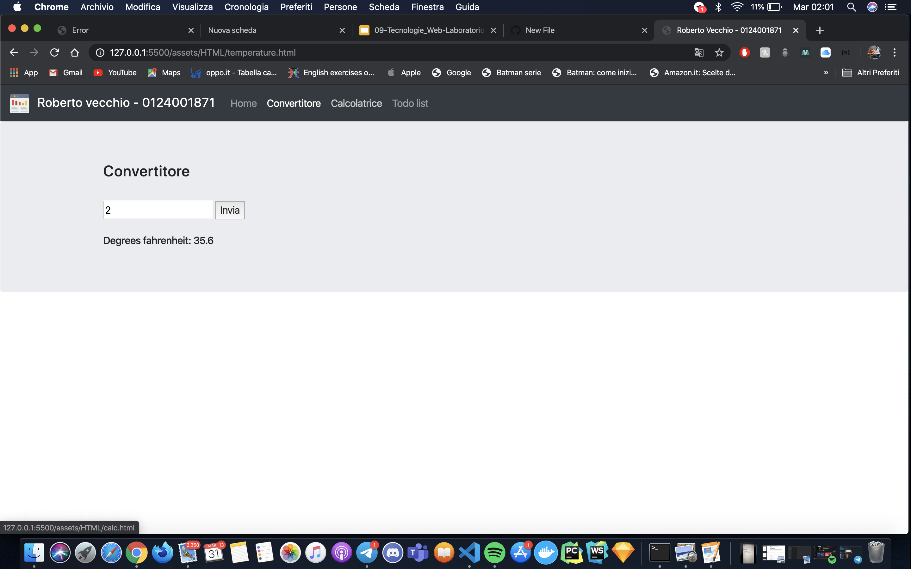
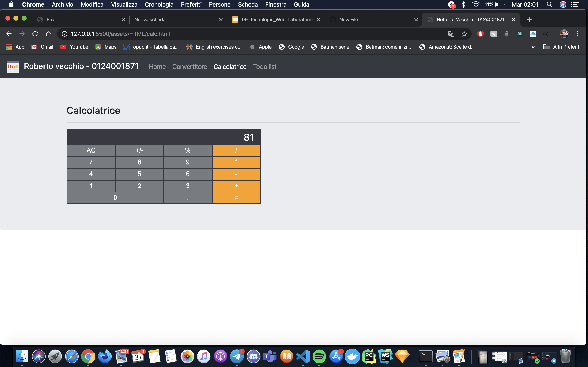
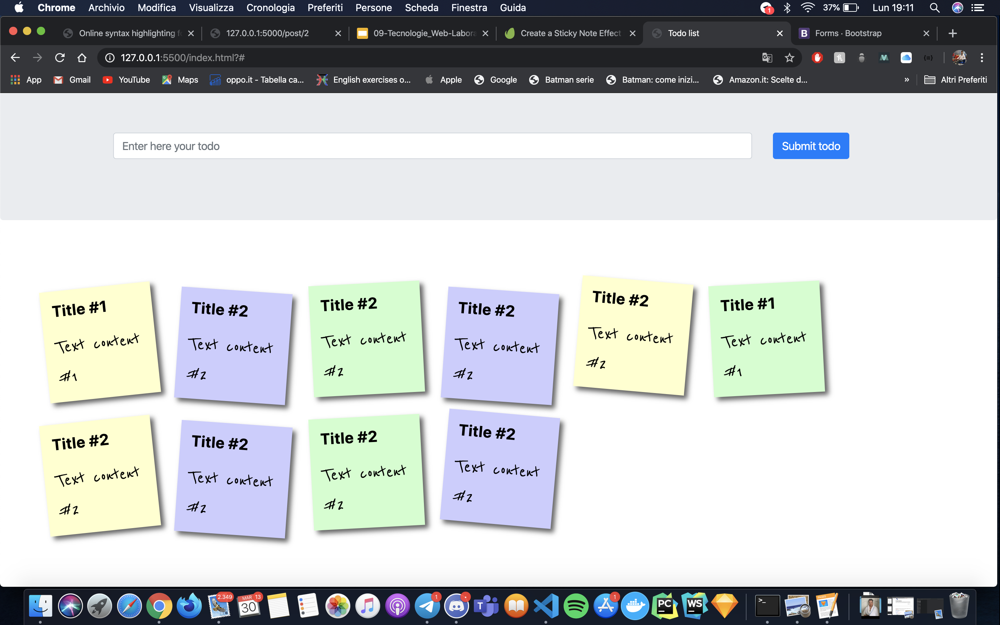

# tecnologie-web-lab-01-
Esercizi di tecnologie web, laboratorio-01
### Esercizio 1
Scrivere un form che consente la conversione fra temperature celsius e fahrenheit.
## Output:

### Esercizio 2
Scrivere un form che mostra una tastiera numerica e permette di fare le 4 operazioni.
## Output:

### Esercizio 3
Scrivere un form che consente di scrivere delle note da visualizzare sulla pagina in box di differente colore. Le note devono poter essere rimosse.
## Output:

